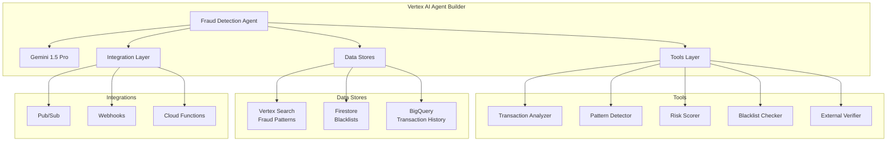

# Fraud Detection Agent - Vertex AI Agent Builder Architecture

## Overview
This document outlines the architecture for migrating the Fraud Detection Expert Agent from the current Vertex AI implementation to Vertex AI Agent Builder (Agent Engine).

## Architecture Components

### 1. Agent Engine Core


## Component Details

### Agent Engine Configuration
- **Model**: Gemini 1.5 Pro 002
- **Temperature**: 0.1 (low for consistency)
- **Max Tokens**: 2048
- **Top-K**: 10
- **Top-P**: 0.95

### Tools Implementation

#### 1. Transaction Analyzer (`analyze_transaction`)
- **Purpose**: Analyze individual transactions for fraud indicators
- **Input**: Transaction details (amount, merchant, location, time, etc.)
- **Output**: Risk indicators and anomaly scores
- **Implementation**: Python function with ML models

#### 2. Pattern Detector (`pattern_detection`)
- **Purpose**: Identify suspicious patterns in transaction history
- **Input**: User ID, transaction window
- **Output**: Pattern anomalies and risk factors
- **Implementation**: Time-series analysis and clustering

#### 3. Risk Scorer (`risk_scoring`)
- **Purpose**: Calculate comprehensive fraud risk score
- **Input**: Multiple risk factors from other tools
- **Output**: Aggregated risk score (0-100)
- **Implementation**: Weighted scoring algorithm

#### 4. Blacklist Checker (`check_blacklist`)
- **Purpose**: Verify entities against known fraud databases
- **Input**: Entity identifiers (account, IP, device, etc.)
- **Output**: Blacklist match status and details
- **Implementation**: Firestore lookup with caching

#### 5. External Verifier (`external_verification`)
- **Purpose**: Cross-check with external fraud services
- **Input**: Transaction and entity details
- **Output**: External risk assessment
- **Implementation**: REST API integration

### Data Store Architecture

#### Vertex Search - Fraud Patterns
```yaml
Index Structure:
  - pattern_id: string (primary key)
  - pattern_type: string (velocity, geographic, amount, etc.)
  - risk_weight: number
  - description: string
  - examples: array<object>
  - last_updated: timestamp
```

#### Firestore - Blacklists
```yaml
Collection Structure:
  /fraud-blacklist/{entity_id}:
    - entity_type: string (account, ip, device, merchant)
    - risk_level: string (high, critical)
    - reason: string
    - added_date: timestamp
    - expires: timestamp (optional)
```

#### BigQuery - Transaction History
```sql
Table: fraud_detection.transactions
  - transaction_id: STRING
  - user_id: STRING
  - amount: NUMERIC
  - merchant_id: STRING
  - location: GEOGRAPHY
  - timestamp: TIMESTAMP
  - fraud_score: NUMERIC
  - is_fraudulent: BOOLEAN
```

## Integration Architecture

### Request Flow
1. **MoE Router** → Sends request to Agent Builder endpoint
2. **Agent Builder** → Processes request with Gemini 1.5 Pro
3. **Tools Execution** → Agent calls relevant tools based on context
4. **Data Retrieval** → Tools access data stores for analysis
5. **Response Generation** → Agent synthesizes tool outputs
6. **Response Delivery** → Structured response back to MoE system

### API Integration
```typescript
interface FraudAgentRequest {
  transactionId: string;
  userId: string;
  amount: number;
  merchantId: string;
  location?: {
    lat: number;
    lng: number;
  };
  deviceInfo?: object;
  metadata?: object;
}

interface FraudAgentResponse {
  fraudAssessment: {
    fraudProbability: number;  // 0-100
    riskLevel: 'Low' | 'Medium' | 'High' | 'Critical';
    riskIndicators: string[];
    recommendedAction: 'Approve' | 'Review' | 'Flag' | 'Block';
    confidence: number;  // 0-100
    reasoning: string;
  };
  processingTime: number;
  agentVersion: string;
}
```

## Deployment Architecture

### GCP Resources
```yaml
Project Structure:
  /agent-builder:
    - Agent: fraud-detection-agent
    - Tools: Cloud Functions (5 functions)
    - Data Stores:
      - Vertex Search Index
      - Firestore Database
      - BigQuery Dataset
    - Integration:
      - Pub/Sub Topics (2)
      - Cloud Scheduler Jobs
      - Monitoring Dashboards
```

### Auto-scaling Configuration
- **Min Replicas**: 2 (high availability)
- **Max Replicas**: 10
- **Target CPU**: 70%
- **Scale-up Rate**: 2 replicas/minute
- **Scale-down Rate**: 1 replica/2 minutes

## Security Architecture

### Authentication & Authorization
- **Service Account**: `fraud-agent@project.iam.gserviceaccount.com`
- **IAM Roles**:
  - `roles/aiplatform.user`
  - `roles/datastore.user`
  - `roles/bigquery.dataViewer`
  - `roles/pubsub.publisher`

### Data Security
- **Encryption at Rest**: Cloud KMS
- **Encryption in Transit**: TLS 1.3
- **PII Handling**: Tokenization for sensitive data
- **Audit Logging**: Cloud Audit Logs

## Performance Targets

### Latency
- **P50**: < 500ms
- **P95**: < 1500ms
- **P99**: < 3000ms

### Throughput
- **Target**: 1000 requests/minute
- **Burst**: 2000 requests/minute

### Availability
- **SLA**: 99.9%
- **Recovery Time**: < 5 minutes
- **Backup Strategy**: Multi-region failover

## Migration Strategy

### Phase 1: Setup (Week 1)
1. Create Agent Builder configuration
2. Deploy tools as Cloud Functions
3. Set up data stores
4. Configure integrations

### Phase 2: Testing (Week 2)
1. Unit test individual tools
2. Integration testing with Agent Builder
3. Load testing for performance validation
4. Security testing and compliance verification

### Phase 3: Migration (Week 3)
1. Deploy to staging environment
2. Parallel run with existing system
3. Validate results consistency
4. Gradual traffic migration (10% → 50% → 100%)

### Phase 4: Optimization (Week 4)
1. Performance tuning based on metrics
2. Cost optimization
3. Documentation updates
4. Training for operations team

## Monitoring & Observability

### Key Metrics
```yaml
Business Metrics:
  - fraud_detection_accuracy
  - false_positive_rate
  - false_negative_rate
  - average_decision_time

Technical Metrics:
  - agent_latency_ms
  - tool_execution_time_ms
  - error_rate
  - request_volume
  - cost_per_request

Operational Metrics:
  - agent_availability
  - data_store_latency
  - integration_failures
  - resource_utilization
```

### Alerting Rules
1. **Critical**: Fraud detection accuracy < 95%
2. **High**: Response time P95 > 2000ms
3. **Medium**: Error rate > 1%
4. **Low**: Cost per request > $0.05

## Cost Estimation

### Monthly Cost Breakdown
- **Agent Builder**: ~$500 (based on 1M requests)
- **Cloud Functions**: ~$200
- **Data Storage**: ~$100
- **Network**: ~$50
- **Total Estimated**: ~$850/month

## Benefits of Migration

1. **Native Agent Capabilities**: Built-in conversation flow and context management
2. **Better Tool Integration**: Seamless tool orchestration
3. **Improved Observability**: Native monitoring and debugging
4. **Cost Optimization**: More efficient resource utilization
5. **Simplified Maintenance**: Centralized configuration and deployment
6. **Enhanced Security**: Built-in compliance features

## Risks and Mitigations

| Risk | Impact | Mitigation |
|------|--------|------------|
| API Changes | High | Version pinning, comprehensive testing |
| Performance Degradation | Medium | Load testing, gradual rollout |
| Data Store Latency | Medium | Caching, connection pooling |
| Cost Overrun | Low | Budget alerts, usage monitoring |
| Integration Failures | Medium | Circuit breakers, fallback mechanisms |

## Success Criteria

1. **Functional**: All fraud detection capabilities maintained or improved
2. **Performance**: Meeting or exceeding current latency targets
3. **Reliability**: 99.9% availability maintained
4. **Cost**: Within 20% of current operational costs
5. **User Experience**: Seamless transition for end users

## Next Steps

1. Review and approve architecture design
2. Set up GCP project and resources
3. Begin implementation of tools
4. Create test data and scenarios
5. Start Phase 1 of migration strategy
