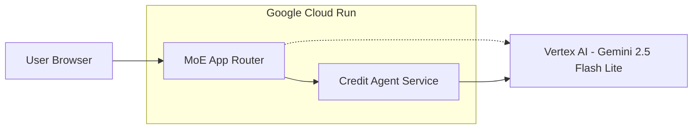
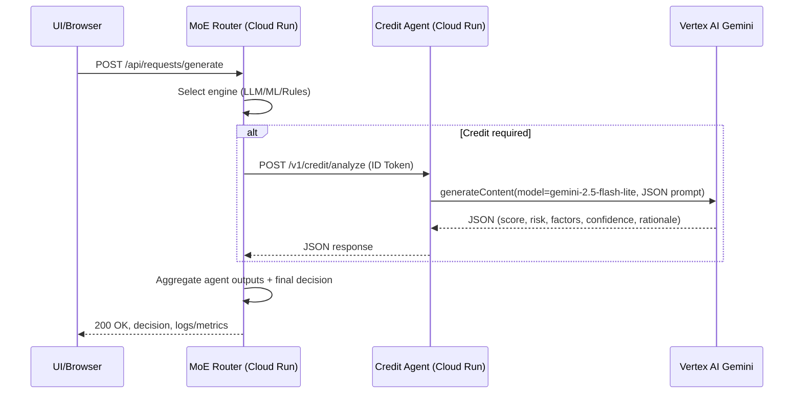

# Credit Agent Migration to Google Cloud Run (Architecture + Code)

This document explains how the Credit Agent was migrated from an in‑process handler to a Cloud Run microservice that the MoE Router invokes securely. It contains:
- Architecture and sequence diagrams
- API contract (request/response DTOs)
- Core agent code (logic) and wrapper (HTTP service)
- Dockerfile and Cloud Build config
- Router integration (secure invocation via Google Id Token)
- Step‑by‑step deployment and verification
- Migration pattern to apply to Fraud and ESG agents

---

## 1) High‑level architecture



Request flow (LLM or Local engine):
1) Browser submits a BFSI request (e.g., Loan Application)
2) MoE Router chooses agents (LLM/MLP/Rules/Hybrid)
3) For Credit, Router posts to Credit Agent (Cloud Run) with a Google Id Token (service‑to‑service auth)
4) Credit Agent calls Vertex AI Gemini, enforces strict JSON output, returns analysis
5) Router aggregates results and produces final decision

---

## 2) Detailed sequence



---

## 3) API contract (Credit Agent)

Endpoint: `POST /v1/credit/analyze`

Request (zod schema):
```json
{
  "applicant_name": "string",
  "annual_income": 75000,
  "credit_history_length": 8,
  "existing_debt": 15000,
  "employment_status": "Full-time",
  "loan_amount": 25000,
  "loan_purpose": "Loan Application - Personal",
  "idempotency_key": "optional-string",
  "metadata": {"requestId": "REQ-..."}
}
```

Response (zod schema):
```json
{
  "status": "success",
  "credit_score": 720,
  "risk_level": "Low", // Low|Medium|High
  "key_factors": ["..."],
  "confidence": 0.9,
  "rationale": "...",
  "processing_time_ms": 153
}
```

---

## 4) Core agent logic (services/credit-agent/src/ai.ts)

Highlights:
- Calls Vertex AI Gemini 2.5 Flash Lite
- Forces JSON output (prompt) and safely parses; repairs if non‑JSON
- Has a kill switch for offline demos

```ts
// services/credit-agent/src/ai.ts
import { generateText } from './vertex';
import type { CreditAnalyzeRequest } from './types';

const MODEL = process.env.CREDIT_MODEL || process.env.AGENT_MODEL_CREDIT || process.env.ROUTER_MODEL || 'gemini-2.5-flash-lite';
const KILL_SWITCH = process.env.CREDIT_AGENT_KILL_SWITCH === '1';

export async function analyzeCredit(req: CreditAnalyzeRequest) {
  const start = Date.now();

  if (KILL_SWITCH) {
    return {
      status: 'success',
      credit_score: 720,
      risk_level: 'Low',
      key_factors: ['Kill switch simulation'],
      confidence: 0.9,
      rationale: 'Simulated response',
      processing_time_ms: Date.now() - start,
    } as const;
  }

  const prompt = `You are a Credit Check Expert Agent. Analyze this loan application and respond in strict JSON.

Application Data:
${JSON.stringify(req, null, 2)}

Respond ONLY with JSON in this schema:
{
  "credit_score": number (300-850),
  "risk_level": "Low" | "Medium" | "High",
  "key_factors": string[],
  "confidence": number (0..1),
  "rationale": string
}`;

  const text = await generateText({ model: MODEL, prompt });
  let parsed: any;
  try { parsed = JSON.parse(text); } catch {
    parsed = { credit_score: 650, risk_level: 'Medium', key_factors: ['LLM output was non-JSON; using fallback'], confidence: 0.5, rationale: text.slice(0, 250) };
  }

  return {
    status: 'success',
    credit_score: Math.min(850, Math.max(300, Number(parsed.credit_score) || 650)),
    risk_level: ['Low', 'Medium', 'High'].includes(parsed.risk_level) ? parsed.risk_level : 'Medium',
    key_factors: Array.isArray(parsed.key_factors) ? parsed.key_factors.map(String) : [],
    confidence: typeof parsed.confidence === 'number' ? Math.max(0, Math.min(1, parsed.confidence)) : 0.7,
    rationale: String(parsed.rationale || 'Analysis complete'),
    processing_time_ms: Date.now() - start,
  } as const;
}
```

Vertex client:
```ts
// services/credit-agent/src/vertex.ts
import { VertexAI } from '@google-cloud/vertexai';
const PROJECT_ID = process.env.GCP_PROJECT_ID || process.env.GOOGLE_CLOUD_PROJECT || '';
const LOCATION = process.env.GCP_LOCATION || 'us-central1';
const API_ENDPOINT = process.env.VERTEX_API_ENDPOINT || `${LOCATION}-aiplatform.googleapis.com`;
let vertex: VertexAI | null = null;
function getVertex(): VertexAI {
  if (!vertex) vertex = new VertexAI({ project: PROJECT_ID || undefined, location: LOCATION, apiEndpoint: API_ENDPOINT } as any);
  return vertex;
}
export async function generateText(options: { model: string; prompt: string }) {
  const v = getVertex();
  const gen = v.getGenerativeModel({ model: options.model });
  const resp = await gen.generateContent({ contents: [{ role: 'user', parts: [{ text: options.prompt }] }] });
  return resp.response?.candidates?.[0]?.content?.parts?.[0]?.text || '';
}
```

---

## 5) HTTP wrapper (services/credit-agent/src/index.ts)

- Validates request payload using zod
- Calls core `analyzeCredit` and returns JSON
- Health/ready endpoints

```ts
// services/credit-agent/src/index.ts
import 'dotenv/config';
import express from 'express';
import pino from 'pino';
import { CreditAnalyzeRequestSchema, CreditAnalyzeResponseSchema } from './types';
import { analyzeCredit } from './ai';

const app = express();
const log = pino({ level: process.env.LOG_LEVEL || 'info' });
app.use(express.json());

app.get('/health', (_req, res) => res.json({ status: 'ok' }));
app.get('/ready', (_req, res) => res.json({ status: 'ready' }));

app.post('/v1/credit/analyze', async (req, res) => {
  try {
    const parsed = CreditAnalyzeRequestSchema.parse(req.body || {});
    const result = await analyzeCredit(parsed);
    const ok = CreditAnalyzeResponseSchema.safeParse(result);
    if (!ok.success) log.warn({ err: ok.error }, 'Response schema validation failed; repairing');
    res.json(result);
  } catch (e: any) {
    log.error({ err: e }, 'credit analyze failed');
    res.status(400).json({ status: 'error', message: e?.message || 'Bad Request' });
  }
});

const PORT = parseInt(process.env.PORT || '8080', 10);
const HOST = process.env.NODE_ENV === 'production' ? '0.0.0.0' : 'localhost';
app.listen(PORT, HOST, () => {
  log.info({ host: HOST, port: PORT }, 'Credit Agent listening');
});
```

DTO types:
```ts
// services/credit-agent/src/types.ts
import { z } from 'zod';
export const CreditAnalyzeRequestSchema = z.object({
  applicant_name: z.string().min(1),
  annual_income: z.number().min(0),
  credit_history_length: z.number().min(0),
  existing_debt: z.number().min(0),
  employment_status: z.string().min(1),
  loan_amount: z.number().min(0),
  loan_purpose: z.string().min(1),
  idempotency_key: z.string().optional(),
  metadata: z.record(z.any()).optional()
});
export const CreditAnalyzeResponseSchema = z.object({
  status: z.enum(['success', 'error']),
  credit_score: z.number().min(300).max(850).optional(),
  risk_level: z.enum(['Low', 'Medium', 'High']).optional(),
  key_factors: z.array(z.string()).optional(),
  confidence: z.number().min(0).max(1).optional(),
  rationale: z.string().optional(),
  processing_time_ms: z.number().optional(),
  trace_id: z.string().optional(),
  message: z.string().optional()
});
```

---

## 6) Docker Agent (Dockerfile) and Cloud Build

Dockerfile (agent):
```dockerfile
# services/credit-agent/Dockerfile
FROM node:20-alpine
WORKDIR /app

# Copy service manifests and install deps
COPY services/credit-agent/package.json services/credit-agent/package-lock.json* ./
RUN npm install --silent

# Copy source
COPY services/credit-agent/tsconfig.json ./
COPY services/credit-agent/src ./src

ENV NODE_ENV=production
ENV PORT=8080
CMD ["npm","run","start"]
```

Cloud Build config:
```yaml
# cloudbuild.credit-agent.yaml
substitutions:
  _REGION: us-central1
  _REPOSITORY: moe-app
  _IMAGE: credit-agent
  _TAG: manual

steps:
  - name: 'gcr.io/cloud-builders/docker'
    id: 'Build credit-agent'
    args: ['build','-f','services/credit-agent/Dockerfile','-t','${_REGION}-docker.pkg.dev/$PROJECT_ID/${_REPOSITORY}/${_IMAGE}:${_TAG}','.']
  - name: 'gcr.io/cloud-builders/docker'
    id: 'Push credit-agent'
    args: ['push','${_REGION}-docker.pkg.dev/$PROJECT_ID/${_REPOSITORY}/${_IMAGE}:${_TAG}']
images:
  - '${_REGION}-docker.pkg.dev/$PROJECT_ID/${_REPOSITORY}/${_IMAGE}:${_TAG}'
```

---

## 7) Router integration (secure invocation)

Helper to call private Cloud Run URLs with Google Id Token:
```ts
// server/gcp/idtoken.ts
import { GoogleAuth, IdTokenClient } from 'google-auth-library';
let clientCache: Record<string, IdTokenClient> = {};
export async function postWithIdToken(url: string, payload: unknown) {
  const aud = url; // Cloud Run URL as audience
  if (!clientCache[aud]) {
    const auth = new GoogleAuth();
    clientCache[aud] = await auth.getIdTokenClient(aud);
  }
  const client = clientCache[aud];
  const resp = await client.request({ url, method: 'POST', data: payload as any, headers: { 'Content-Type': 'application/json' } });
  return { status: resp.status || 200, data: resp.data };
}
```

Router calling the agent:
```ts
// server/real-moe-system.ts (excerpt inside processCreditRequest)
const creditAgentUrl = process.env.CREDIT_AGENT_URL;
if (creditAgentUrl) {
  try {
    const { postWithIdToken } = await import('./gcp/idtoken');
    const payload = { /* applicant + request fields */ };
    const resp = await postWithIdToken(creditAgentUrl.replace(/\/$/, '') + '/v1/credit/analyze', payload);
    if (resp.status >= 200 && resp.status < 300) {
      return { agentType: 'credit', analysis: JSON.stringify(resp.data), processingTime: Date.now() };
    }
  } catch (e) { /* fallback to LLM path */ }
}
```

Environment wiring:
- On credit-agent: set GCP_PROJECT_ID, GCP_LOCATION, VERTEX_API_ENDPOINT, AGENT_MODEL_CREDIT
- On router (moe-app): set CREDIT_AGENT_URL to the credit-agent URL; grant router SA roles/run.invoker on credit-agent

---

## 8) Deployment (summary)

1) Build and push agent image:
```bash
gcloud builds submit --config=cloudbuild.credit-agent.yaml \
  --substitutions _REGION=us-central1,_REPOSITORY=moe-app,_IMAGE=credit-agent,_TAG=$(git rev-parse --short HEAD)
```
2) Deploy credit-agent (private):
```bash
gcloud run deploy credit-agent --image=us-central1-docker.pkg.dev/$PROJECT_ID/moe-app/credit-agent:$(git rev-parse --short HEAD) \
  --region=us-central1 --no-allow-unauthenticated \
  --set-env-vars=NODE_ENV=production,GCP_PROJECT_ID=$PROJECT_ID,GCP_LOCATION=us-central1,VERTEX_API_ENDPOINT=us-central1-aiplatform.googleapis.com,AGENT_MODEL_CREDIT=gemini-2.5-flash-lite
```
3) Grant router SA invoke permission, set router env:
```bash
ROUTER_SA=$(gcloud run services describe moe-app --region=us-central1 --format='value(spec.template.spec.serviceAccountName)')
if [ -z "$ROUTER_SA" ]; then PN=$(gcloud projects describe $PROJECT_ID --format='value(projectNumber)'); ROUTER_SA="$PN-compute@developer.gserviceaccount.com"; fi
CREDIT_URL=$(gcloud run services describe credit-agent --region=us-central1 --format='value(status.url)')
gcloud run services add-iam-policy-binding credit-agent --region=us-central1 --member=serviceAccount:$ROUTER_SA --role=roles/run.invoker

gcloud run services update moe-app --region=us-central1 --update-env-vars=CREDIT_AGENT_URL=$CREDIT_URL
```

---

## 9) Migration pattern for other agents

Repeat the pattern for Fraud and ESG:
- Scaffold `services/fraud-agent` and `services/esg-agent` with:
  - POST /v1/fraud/assess and POST /v1/esg/evaluate
  - zod DTOs, health/ready endpoints
  - Vertex AI call with strict JSON output and safe parsing
  - Dockerfile + cloudbuild YAML
- Deploy to Cloud Run (private), set FRAUD_AGENT_URL and ESG_AGENT_URL on router
- Grant invoke permissions to router SA
- Update router to call them first; fallback to LLM path on errors

---

## 10) Design comparison (before vs after)

| Aspect | Before (in‑process) | After (Cloud Run agent) |
|---|---|---|
| Execution | Inside MoE App container | Separate Cloud Run service |
| Contract | Implicit TS types | Explicit HTTP + JSON DTOs (zod) |
| Security | N/A (in‑process) | S2S auth via Google Id Token; roles/run.invoker |
| Observability | Router logs only | Per‑agent logs/metrics + router logs |
| Scaling | Tied to router | Independent autoscaling and SLOs |
| Failure isolation | Shared process | Isolated service; retries/circuit breakers |
| Replaceability | Rebuild router | Swap agent image independently |

---

## 11) Notes
- Keep strict JSON outputs and confidence thresholds for robust behavior
- Use kill switch envs in agents for safe demos
- Scrub PII in logs; adopt retention + redaction policies in enterprise setup
- Extend this design with OpenAPI specs and formal tool registration for LLM function‑calling

