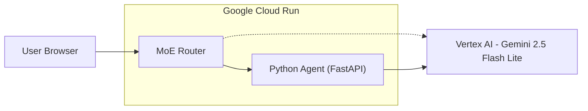

# Python Agent on Cloud Run with Vertex AI (Gemini 2.5 Flash Lite)

This guide shows how to implement a Python agent (FastAPI) that runs on Google Cloud Run, calls Vertex AI (Gemini 2.5 Flash Lite), and integrates with the MoE Router via secure service‑to‑service auth.

What you get
- Architecture and sequence diagrams (GitHub‑friendly Mermaid)
- API contract (Pydantic models)
- Reference code for the agent (FastAPI)
- Dockerfile and requirements.txt
- Cloud Build (optional) config
- Deploy commands to Cloud Run (private)
- Secure router invocation via Google Id Token
- Security/PII guidance for BFSI
- Troubleshooting and FAQ

---

## Architecture



Notes
- Router → PyAgent uses service‑to‑service invocation (Google Id Token).
- PyAgent calls Vertex AI using Application Default Credentials (service account on Cloud Run).
- Keep PII out of LLM calls; use deterministic pipelines for regulated data.

---

## API contract (example)

Request (Pydantic):
```python
from pydantic import BaseModel, Field
class AnalyzeRequest(BaseModel):
    subject_token: str = Field(..., description="Tokenized identity (no SSN)")
    purpose: str = Field("credit_underwriting")
    features: dict = Field(default_factory=dict, description="Redacted/derived features only")
```

Response (Pydantic):
```python
class AnalyzeResponse(BaseModel):
    status: str
    credit_score: int | None = None
    risk_level: str | None = None
    key_factors: list[str] | None = None
    confidence: float | None = None
    rationale: str | None = None
    processing_time_ms: int | None = None
    message: str | None = None
```

---

## Reference agent (FastAPI)

File: app.py
```python
import os
import time
from fastapi import FastAPI, HTTPException
from pydantic import BaseModel, Field
import vertexai
from vertexai.generative_models import GenerativeModel, Part, Content

PROJECT_ID = os.getenv("GCP_PROJECT_ID") or os.getenv("GOOGLE_CLOUD_PROJECT", "")
LOCATION = os.getenv("GCP_LOCATION", "us-central1")
API_ENDPOINT = os.getenv("VERTEX_API_ENDPOINT", f"{LOCATION}-aiplatform.googleapis.com")
MODEL_ID = os.getenv("AGENT_MODEL", "gemini-2.5-flash-lite")
ALLOW_LLM_SUMMARY = os.getenv("ALLOW_LLM_SUMMARY", "0") == "1"

app = FastAPI()

class AnalyzeRequest(BaseModel):
    subject_token: str = Field(..., description="Tokenized identity reference (no SSN)")
    purpose: str = Field("credit_underwriting")
    features: dict = Field(default_factory=dict)

class AnalyzeResponse(BaseModel):
    status: str
    credit_score: int | None = None
    risk_level: str | None = None
    key_factors: list[str] | None = None
    confidence: float | None = None
    rationale: str | None = None
    processing_time_ms: int | None = None
    message: str | None = None

def init_vertex():
    vertexai.init(project=PROJECT_ID, location=LOCATION, api_endpoint=API_ENDPOINT)

def summarize_non_pii(data: dict) -> str:
    if not ALLOW_LLM_SUMMARY:
        return "Summary disabled"
    model = GenerativeModel(MODEL_ID)
    prompt = f"Summarize non-PII risk factors briefly as JSON: {data}"
    contents = [Content(role="user", parts=[Part.from_text(prompt)])]
    resp = model.generate_content(contents)
    return (resp.text or "")[:300]

@app.get("/health")
def health():
    return {"status": "ok"}

@app.get("/ready")
def ready():
    return {"status": "ready"}

@app.post("/v1/agent/analyze", response_model=AnalyzeResponse)
def analyze(req: AnalyzeRequest):
    t0 = time.time()
    # Deterministic placeholder — replace with your bureau/gateway & rules engine.
    derived = req.features or {"utilization": 0.42, "delinquencies_12m": 0, "inquiries_6m": 1}
    score = 710
    factors = []
    risk = "Low"
    if derived.get("utilization", 0) > 0.5:
        risk = "Medium"; factors.append("High utilization")
    if derived.get("delinquencies_12m", 0) > 0:
        risk = "High"; factors.append("Recent delinquency")

    rationale = summarize_non_pii({"risk": risk, "factors": factors, "score": score})
    return AnalyzeResponse(
        status="success",
        credit_score=score,
        risk_level=risk,
        key_factors=factors,
        confidence=0.9,
        rationale=rationale,
        processing_time_ms=int((time.time()-t0)*1000),
    )

init_vertex()
```

requirements.txt
```text
fastapi==0.111.0
uvicorn[standard]==0.29.0
google-cloud-aiplatform>=1.66.0
pydantic==2.8.2
```

Dockerfile
```dockerfile
FROM python:3.11-slim
WORKDIR /app
ENV PYTHONDONTWRITEBYTECODE=1
ENV PYTHONUNBUFFERED=1

RUN apt-get update && apt-get install -y --no-install-recommends curl && rm -rf /var/lib/apt/lists/*

COPY requirements.txt .
RUN pip install --no-cache-dir -r requirements.txt

COPY app.py .

ENV PORT=8080
CMD exec uvicorn app:app --host 0.0.0.0 --port ${PORT}
```

---

## Cloud Build (optional)

cloudbuild.python-agent.yaml
```yaml
substitutions:
  _REGION: us-central1
  _REPOSITORY: moe-app
  _IMAGE: py-agent
  _TAG: manual

steps:
  - name: 'gcr.io/cloud-builders/docker'
    id: 'Build py-agent'
    args: ['build','-f','Dockerfile','-t','${_REGION}-docker.pkg.dev/$PROJECT_ID/${_REPOSITORY}/${_IMAGE}:${_TAG}','.']

  - name: 'gcr.io/cloud-builders/docker'
    id: 'Push py-agent'
    args: ['push','${_REGION}-docker.pkg.dev/$PROJECT_ID/${_REPOSITORY}/${_IMAGE}:${_TAG}']

images:
  - '${_REGION}-docker.pkg.dev/$PROJECT_ID/${_REPOSITORY}/${_IMAGE}:${_TAG}'
```

---

## Deploy to Cloud Run (private)

```bash
PROJECT_ID=moe-app-bfsi-1757248254
REGION=us-central1
IMAGE=us-central1-docker.pkg.dev/$PROJECT_ID/moe-app/py-agent:$(git rev-parse --short HEAD)

# Build & push (Cloud Build)
gcloud builds submit --config=cloudbuild.python-agent.yaml \
  --substitutions _REGION=$REGION,_REPOSITORY=moe-app,_IMAGE=py-agent,_TAG=$(git rev-parse --short HEAD)

# Deploy (no public access)
gcloud run deploy py-credit-agent \
  --image=$IMAGE \
  --region=$REGION \
  --no-allow-unauthenticated \
  --service-account=credit-sa@$PROJECT_ID.iam.gserviceaccount.com \
  --set-env-vars=NODE_ENV=production,GCP_PROJECT_ID=$PROJECT_ID,GCP_LOCATION=$REGION,VERTEX_API_ENDPOINT=$REGION-aiplatform.googleapis.com,AGENT_MODEL=gemini-2.5-flash-lite
```

Grant router to invoke agent
```bash
ROUTER_SA=$(gcloud run services describe moe-app --region=$REGION --format='value(spec.template.spec.serviceAccountName)')
PY_AGENT_URL=$(gcloud run services describe py-credit-agent --region=$REGION --format='value(status.url)')

gcloud run services add-iam-policy-binding py-credit-agent \
  --region=$REGION \
  --member=serviceAccount:$ROUTER_SA \
  --role=roles/run.invoker

gcloud run services update moe-app \
  --region=$REGION \
  --update-env-vars=PY_CREDIT_AGENT_URL=$PY_AGENT_URL
```

---

## Secure invocation from Router (Node example)

The MoE Router should call the agent using a Google Id Token with the service URL as the audience. Node helper pattern (already in this repo for JS agents):

```ts
import { GoogleAuth, IdTokenClient } from 'google-auth-library';
let cache: Record<string, IdTokenClient> = {};
export async function postWithIdToken(url: string, payload: unknown) {
  const aud = url;
  if (!cache[aud]) cache[aud] = await new GoogleAuth().getIdTokenClient(aud);
  const client = cache[aud];
  const resp = await client.request({ url, method: 'POST', data: payload as any, headers: { 'Content-Type': 'application/json' } });
  return { status: resp.status || 200, data: resp.data };
}
```

---

## Security & BFSI notes
- Do not pass SSNs or raw bureau reports to LLMs.
- Use tokenized identity and a deterministic bureau gateway with audit trails for regulated pulls.
- If you enable summaries, redact all PII and disable Vertex data logging per policy.
- Keep the agent private (no public invoke); use roles/run.invoker and Google Id Tokens.
- Use Secret Manager for secrets; avoid embedding keys in env.

---

## Troubleshooting

| Symptom | Likely cause | Fix |
|---|---|---|
| 404 model not found | Wrong region/endpoint | Set VERTEX_API_ENDPOINT=us-central1-aiplatform.googleapis.com; model=gemini-2.5-flash-lite |
| 401 UNAUTH when calling agent | Missing Id Token or no invoker role | Use IdTokenClient; grant roles/run.invoker to router SA |
| 403 on Vertex | SA lacks roles/aiplatform.user | Grant roles/aiplatform.user to agent SA |
| LLM response not JSON | Model drift | Add strict prompt + repair loop (already handled in code) |

---

## FAQ
- Can I run Python agents alongside Node agents? Yes—Cloud Run is polyglot; each agent is its own container.
- Do I need public URLs? No—keep agents private; Router invokes them with ID tokens.
- Does the agent need a GPU? Not for calling Gemini; the inference runs on Vertex.

---

## Next steps
- Add OpenAPI (Swagger) spec for the agent
- Add evaluator scripts for latency/accuracy
- Integrate with a deterministic bureau pipeline (no LLM) and keep LLM summaries optional

